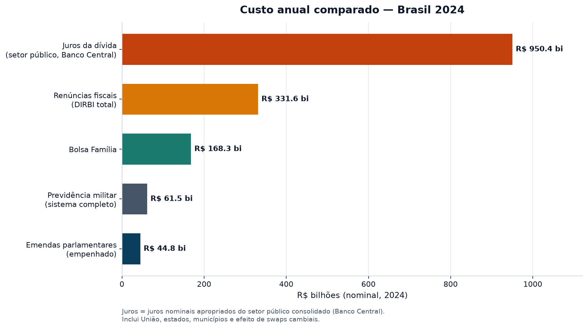
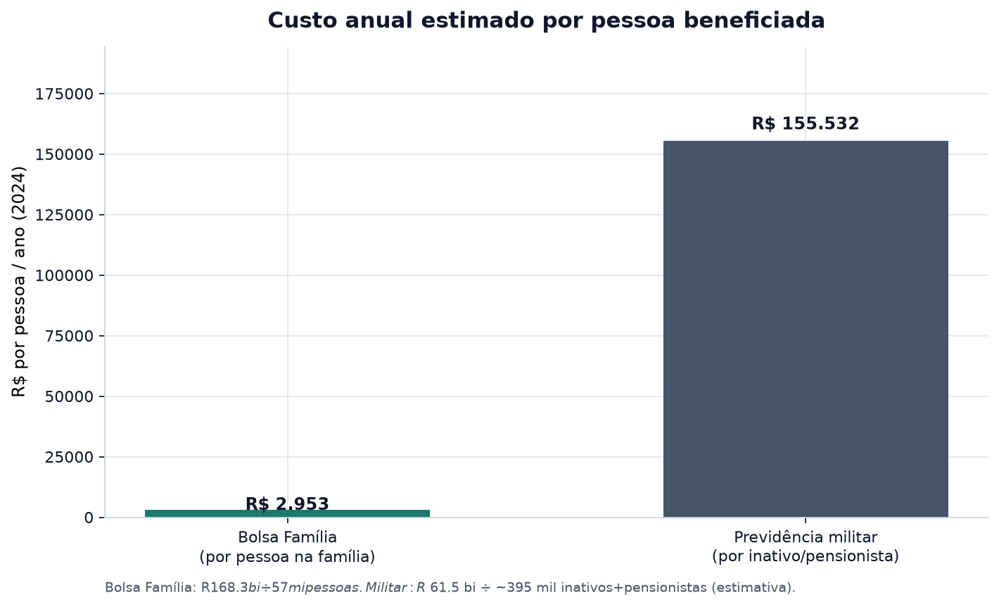
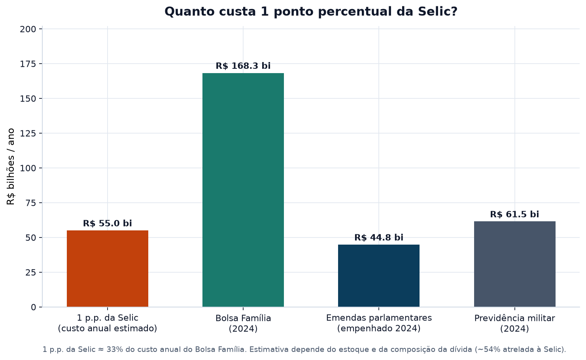
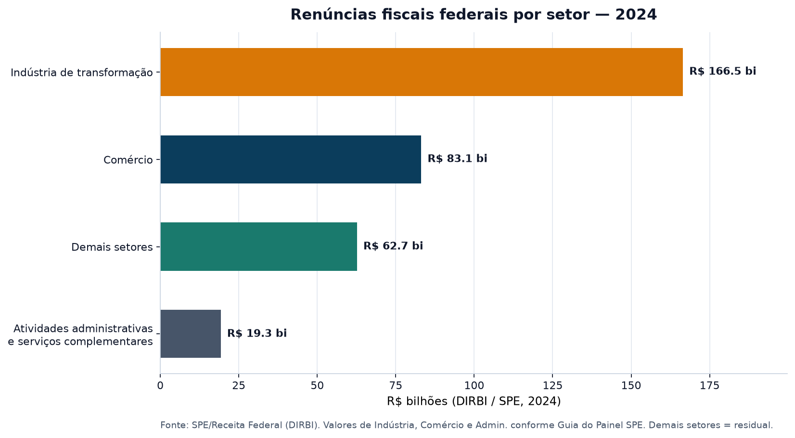
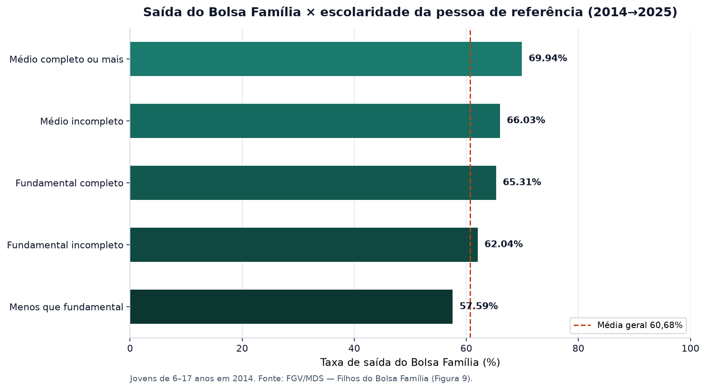
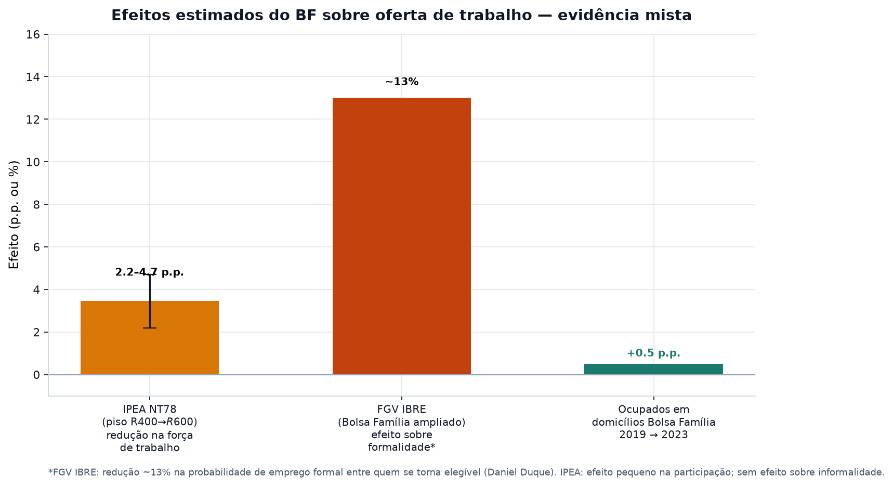
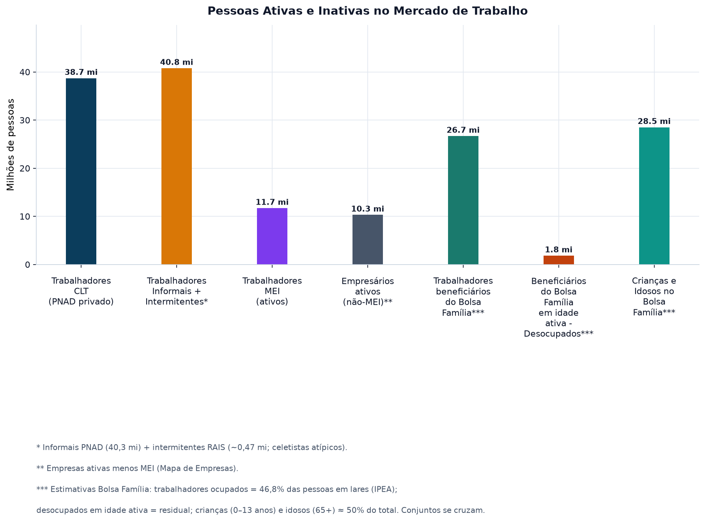
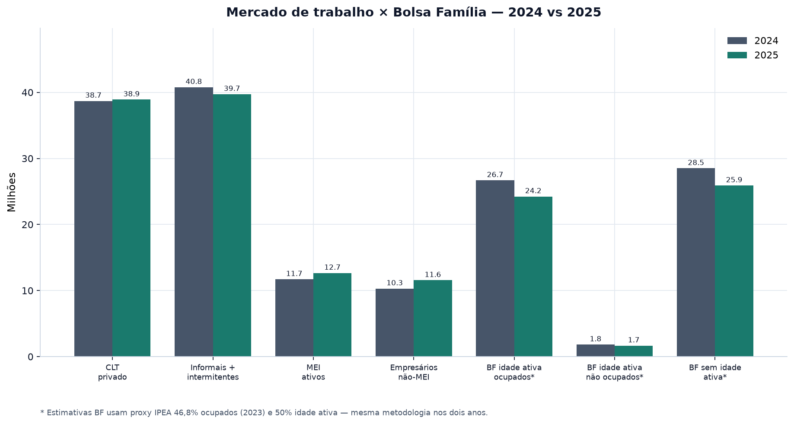
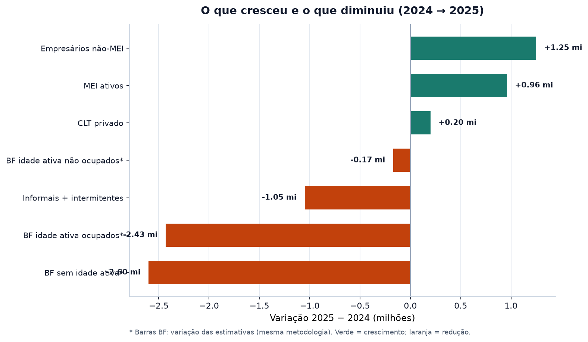
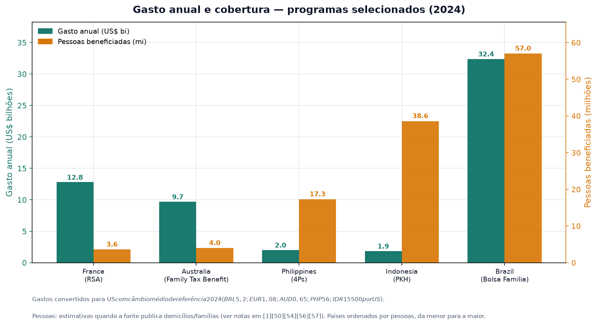

# Bolsa Família em perspectiva — Pesquisa comparativa 2024

**Ano-base:** 2024 para custos fiscais e comparativos das seções 2–5; **2025**
para o recorte mercado de trabalho × Bolsa Família (seções 8–9), com 2024
arquivado para a comparação ano a ano.

**Objetivo:** Reunir números oficiais e estudos institucionais (MDS, IBGE, Banco Central,
Tesouro, Receita/SPE, TCU, IPEA, FGV) para que o leitor possa se informar,
formar a própria opinião e tomar as próprias decisões. Esta Pesquisa não
defende nem ataca o programa.

> Esta Pesquisa não é um guia de conversa nem uma apresentação. É um mapa de
> custos e evidências, com link para cada fonte.

---

## 0. Cuidados ao ler este estudo

Os números deste estudo **não são todos a mesma coisa**. Misturar unidades
é o erro mais comum — e muda o resultado da conta.

| Conceito        | Unidade                               | Por que importa                             |
| --------------- | ------------------------------------- | ------------------------------------------- |
| Bolsa Família   | **Famílias** (e pessoas nas famílias) | Não é o mesmo que “empregos”                |
| CLT / PNAD      | **Pessoas** ocupadas                  | Pesquisa amostral do IBGE                   |
| RAIS / CAGED    | **Vínculos** formais                  | Um trabalhador pode ter mais de um vínculo  |
| Renúncia fiscal | Receita que **deixa de entrar**       | Não é transferência em caixa como no Bolsa Família      |
| Juros (Banco Central)      | Setor público **consolidado**         | Inclui União + estados + municípios + swaps |

Valores em **reais nominais de 2024**, salvo indicação contrária.

### Como ler os blocos “Opiniões e Fatos”

Ao longo da Pesquisa, há blocos com este formato:

| Ícone | Significado                                                                         |
| ----- | ----------------------------------------------------------------------------------- |
| 💬    | **Opinião** — o que circula na internet, em podcasts, colunas e redes. Não é prova. |
| 📌    | **Fato** — o que números oficiais ou estudos institucionais mostram.                |
| 🔎    | **Limite** — o que a opinião omite, mistura ou simplifica demais.                   |

A quantidade de opiniões em cada seção segue o que mais viralizou sobre aquele
tema — não um empate artificial entre “a favor” e “contra”. Opinião viralizada
não vira fato por ser popular.

---

## 1. Por que estas rúbricas no comparativo

O gráfico principal desta Pesquisa coloca o Bolsa Família ao lado de **juros**,
**renúncias fiscais**, **previdência militar** e **emendas parlamentares**.

Poderiam ser outras. Saúde, educação, BPC, INSS civil, subsídios a combustíveis
ou o orçamento da Defesa ativa também são gastos grandes. **Essas quatro
rúbricas foram escolhidas só para comparar ordens de grandeza de custo** para a
União e o setor público brasileiro — não para dizer qual política é mais
importante para a sociedade, a economia, a soberania ou a justiça.

Em linguagem simples: o comparativo responde “quanto custa cada uma?”, não
“qual merece existir?”.

### Juros da dívida pública

Muitas vezes ficam fora do radar de quem não acompanha economia. Ainda assim,
são um dos **maiores pesos financeiros** do país: em 2024, o setor público
consolidado apropriou **R$ 950,4 bi** em juros nominais [5].

Esse dinheiro **não vira escola, hospital, estrada nem benefício social
direto**. É o custo de carregar a dívida já existente. Quem recebe são os
detentores de títulos públicos (bancos, fundos, empresas e pessoas físicas).
Por isso o debate público costuma dizer que esse fluxo tende a remunerar o
**rentismo** (renda de quem empresta ao Estado) mais do que a **produção**
(fábricas, lavouras, serviços). Esta Pesquisa registra o tamanho da conta;
não julga se a taxa de juros deveria ser outra — isso entra nas opiniões da
seção 4.

### Renúncias fiscais

Renúncia fiscal é imposto que a lei **deixa de cobrar**. Pode ter papel
relevante na economia: baratear emprego formal, atrair indústria para uma
região, reduzir o preço de insumos agrícolas ou manter cadeias produtivas
competitivas.

A comparação com o Bolsa Família não é porque as duas políticas sejam
“iguais”. É porque **as duas são benefícios concedidos a um setor específico**
da sociedade: o Bolsa Família, a famílias de baixa renda; as renúncias, a empresas e
setores definidos em lei. Uma sai como transferência em caixa; a outra, como
receita que não entra. Para o caixa público, as duas diminuem o espaço
orçamentário.

### Previdência militar

As Forças Armadas são instituição de **soberania**: defesa do território,
missões de paz, garantia da lei e da ordem quando convocadas. Nada nesta
Pesquisa avalia o valor estratégico das Forças.

A rúbrica entra no comparativo por outro motivo: trata-se de um **benefício
pago a pessoas que, enquanto beneficiárias, não estão no serviço ativo** —
inativos e pensionistas. A mesma lógica contábil vale para qualquer
previdência: o pagamento é a quem já saiu (ou nunca esteve) da atividade
produtiva da carreira. O ponto é o **custo por pessoa**, não o mérito da
farda.

### Emendas parlamentares

Emenda parlamentar é o trecho do Orçamento em que deputados e senadores
indicam para onde vai parte do dinheiro federal — em tese, para obras,
saúde, educação e demandas locais que o Executivo pode não priorizar.

Elas entram no comparativo porque são um **peso financeiro visível** e porque
sua eficácia tem sido questionada: falta de transparência (o chamado
“orçamento secreto” e formatos parecidos depois de 2022), pulverização do
gasto e **investigações recentes** sobre irregularidades, desvio e
rastreabilidade. O TCU, em amostra de “emendas Pix” (2020–2024), apontou
irregularidades na maior parte dos casos fiscalizados [37]. Isso não prova
que toda emenda seja ilícita; prova que o instrumento está sob suspeita
pública de baixa eficácia.

---

## 2. Custo anual comparado (2024)

| Rubrica                                    | Valor 2024      | Fonte |
| ------------------------------------------ | --------------- | ----- |
| Juros nominais — setor público consolidado | **R$ 950,4 bi** | [5]   |
| Renúncias fiscais federais (DIRBI)         | **R$ 331,6 bi** | [16]  |
| Bolsa Família                              | **R$ 168,3 bi** | [1]   |
| Previdência militar (sistema completo)     | **R$ 61,5 bi**  | [11]  |
| Emendas parlamentares (empenhado)          | **R$ 44,8 bi**  | [7]   |

**Leitura rápida**

- O Bolsa Família custou cerca de **18%** do que o setor público consolidado apropriou
em juros.
- O Bolsa Família custou cerca de **51%** do total de renúncias fiscais federais
declaradas na DIRBI.
- Emendas empenhadas (R$ 44,8 bi) ficaram abaixo da previdência militar; o
valor **pago** das emendas foi R$ 31,4 bi [7].

> **Nota metodológica:** a barra de juros usa a definição do **Banco Central
> para o setor público consolidado** (escolha deste estudo). É mais ampla que
> o orçamento isolado da União e inclui o resultado de swaps cambiais em 2024
> [5][6].

### Opiniões e Fatos

> 💬 **“O Bolsa Família quebra o país.”**
>
> 📌 Em 2024 o programa custou **R$ 168,3 bi** [1]. Só os juros do setor
> público consolidado foram **R$ 950,4 bi** — cerca de **5,6 vezes** o Bolsa Família [5].
> As renúncias fiscais federais (R$ 331,6 bi) também superaram o programa [16].
>
> 🔎 “Quebrar o país” é opinião sobre prioridade, não um dado. O Bolsa Família é grande
> em reais e pequeno ao lado de juros e desonerações. Quem acha o programa
> caro e quem acha barato está, na prática, escolhendo **com o que comparar**.

> 💬 **“Não é gasto, é investimento — cada R$ 1 vira R$ 1,78 no PIB.”**
>
> 📌 Estudo do IPEA sobre transferências sociais estimou multiplicador de
> **R$ 1,78** no PIB para cada R$ 1 adicional no Bolsa Família, e **R$ 2,40** no consumo
> das famílias — o maior entre as sete transferências comparadas [38]. A tese
> circula em colunas, redes e defesas do programa (“pobre gasta no mercadinho
> do bairro”).
>
> 🔎 Multiplicador **não é lucro em caixa**. Depende de hipóteses (capacidade
> ociosa na economia, famílias gastando quase tudo que recebem). Não prova que
> o programa “se pague sozinho” no Orçamento, nem que outras despesas sejam
> inúteis.

> 💬 **“Emenda parlamentar é o que faz o dinheiro chegar no interior.”**
>
> 📌 Emendas existem para o Congresso indicar gastos locais. Parlamentares e
> o presidente do Congresso têm defendido o instrumento contra o que chamam
> de “criminalização” — argumento de que o recurso alcança municípios que o
> Executivo não prioriza [40].
>
> 🔎 O mesmo instrumento está no centro de investigação e auditoria. O STF
> considerou inconstitucional o “orçamento secreto”. A Transparência Brasil
> apontou formatos posteriores com baixa identificação de autoria [36]. O TCU
> achou irregularidades em **82%** de uma amostra de “emendas Pix” [37]. Levar
> dinheiro ao município e gastar com rastreio fraco **não são a mesma coisa**.

---

## 3. Previdência militar × Bolsa Família

### Escala e custo por pessoa

| Indicador                         | Bolsa Família                                  | Previdência militar (SPSMFA)                                                                             |
| --------------------------------- | ---------------------------------------------- | -------------------------------------------------------------------------------------------------------- |
| Custo anual 2024                  | R$ 168,3 bi [1]                                | ~R$ 61,5 bi (despesas) [11]                                                                              |
| Déficit do sistema                | —                                              | ~R$ 52,3 bi [11]                                                                                         |
| Unidades principais               | ~21,1 mi **famílias** (jan/2024) [27]          | 235.416 **pensionistas** pagos em 2024 [12] + ~160 mil inativos (estimativa a partir da folha da Defesa) |
| Pessoas afetadas                  | **57 mi** pessoas nas famílias (jan/2024) [27] | ~395 mil inativos + pensionistas (ordem de grandeza)                                                     |
| Custo aproximado por pessoa / ano | ~**R$ 2.950** (R$ 168,3 bi ÷ 57 mi)            | ~**R$ 155.000** (R$ 61,5 bi ÷ ~395 mil)                                                                  |
| Benefício médio familiar          | ~R$ 686/mês (jan/2024) [27]                    | Pensão média muito superior; pensões militares = 100% do soldo de referência [12]                        |

O Bolsa Família atende dezenas de milhões de pessoas com um valor pequeno por pessoa. O
sistema militar custa **menos no total** e **muito mais por beneficiário**. O
TCU aponta déficit per capita militar da ordem de R$ 159 mil/ano, contra cerca
de R$ 9,4 mil no INSS [11][12].

### Nota: filhas de militares, viúvas e “morte ficta”

Transparência **parcial** — não há painel único atualizado com todas as
categorias:

**Filhas de militares (dado CGU, 2020)** [15]

- De **226 mil** pensionistas militares, **137.916** eram filhas (~**60%**).
- Em 2020, pensões militares somaram R$ 19,3 bi; a maior parte foi para filhas.
- Regra histórica: filhas solteiras podiam receber pensão vitalícia (regras
mudaram para ingressos após 2000/2001; contribuição sobre pensão veio com a
reforma de 2019). O estoque antigo continua sendo pago.

**Morte ficta (militares expulsos tratados como falecidos para fins de
pensão)** [13][14]

| Força                 | Militares (morte ficta) | Pensionistas | Custo anual                       |
| --------------------- | ----------------------- | ------------ | --------------------------------- |
| Exército              | 238                     | 310          | ~R$ 20 mi                         |
| Marinha + Aeronáutica | 308                     | 493          | Marinha sozinha ~R$ 4,5 mi (2023) |

- Instituto previsto no Estatuto dos Militares: a família continua com pensão
mesmo após expulsão por crime grave.
- Dados obtidos via **Lei de Acesso à Informação** (não são transparência
ativa completa).

**Pensões especiais / anistiados** [9]

- 17.313 pensões especiais (média ~R$ 5,5 mil/mês).
- 4.643 reparações a anistiados políticos militares (média ~R$ 11,3 mil/mês).

### Opiniões e Fatos

> 💬 **“Pensão de filha de militar é privilégio do século XIX.”**
>
> 📌 Em 2020, cerca de **60%** dos pensionistas militares eram filhas [15].
> O benefício vitalício para novas filhas foi encerrado em 2001, mas quem já
> estava na regra antiga (e quem contribuiu com alíquota extra) segue
> recebendo. O MP junto ao TCU pediu avaliação do impacto fiscal; ministros
> do TCU já chamaram o desenho de distorção e falta de isonomia com civis
> [15][11].
>
> 🔎 O dado descreve **regra de pensão**, não o soldado na ativa. Comparar
> pensão de filha com Bolsa Família mistura dois públicos diferentes. O que
> os números permitem afirmar é o **custo por pessoa** dos dois sistemas.

> 💬 **“Não é privilégio: militar não tem FGTS, hora extra nem direito de
> greve — e pode morrer na guerra.”**
>
> 📌 O Exército publicou material defendendo regime próprio: restrições da
> carreira (disponibilidade permanente, sem adicional de periculosidade nos
> moldes civis, sem greve) e o risco de conflito, que segundo a força
> inviabilizaria um fundo previdenciário comum. A tese: o tratamento na
> reserva **compensa** o que o militar não tem na ativa [35].
>
> 🔎 Restrições da carreira são fato jurídico. Se a compensação na reserva
> está no tamanho certo é **opinião de desenho institucional**. O TCU
> registra déficit per capita muito acima do INSS [11]. Uma coisa não anula
> a outra: pode haver risco real na profissão **e** conta previdenciária
> cara.

> 💬 **“Comparar Bolsa Família com militar é desonrar quem defende o país.”**
>
> 📌 Esta Pesquisa compara **ordens de grandeza de custo**, não o valor
> moral das Forças Armadas (seção 1). O sistema militar custou ~R$ 61,5 bi
> em 2024 para centenas de milhares de inativos e pensionistas; o Bolsa Família,
> R$ 168,3 bi para 57 milhões de pessoas nas famílias [1][11][27].
>
> 🔎 Quem recusa a comparação por respeito à farda e quem a usa para
> atacar as Forças está, nos dois casos, saindo do dado e indo para o
> juízo político. O dado disponível é custo total e custo por pessoa.

---

## 4. O custo de cada 1% da taxa de juros

**Número-chave:** cada **1 ponto percentual** da Selic custa cerca de
**R$ 55 bilhões por ano** aos cofres públicos [26].

Em linguagem simples: Selic é a taxa básica de juros do Brasil, definida
pelo Banco Central. Quando ela sobe, o governo paga mais para rolar a
dívida.

| Comparação               | Valor                                      |
| ------------------------ | ------------------------------------------ |
| 1 p.p. Selic             | ~R$ 55 bi/ano                              |
| Bolsa Família 2024       | R$ 168,3 bi                                |
| Relação                  | 1 p.p. ≈ **33%** do Bolsa Família anual               |
| Emendas 2024 (empenhado) | R$ 44,8 bi — **menos** que 1 p.p. da Selic |

**Como isso funciona**

1. A Selic é a taxa básica de juros definida pelo Banco Central.
2. Uma parcela grande da dívida pública (cerca de **54%** em leituras
  recentes) remunera-se pela Selic [29].
3. Quando a Selic sobe 1 p.p., o custo de carregar essa fatia sobe na mesma
  direção — daí a estimativa de dezenas de bilhões ao ano.

Em 2024, os juros nominais do setor público consolidado chegaram a
**R$ 950,4 bi** (8,05% do PIB), impulsionados pelo estoque da dívida e por
perdas em swaps cambiais [5][6].

> **Limite da estimativa:** R$ 55 bi/p.p. **não é um valor fixo em lei**.
> Muda com o tamanho da dívida e com a fatia pós-fixada. Serve como régua de
> ordem de grandeza citada a partir de comunicações do Banco Central [26].

### Opiniões e Fatos

> 💬 **“Selic alta é o ‘Bolsa-rentismo’: transfere mais renda do que o
> Bolsa Família.”**
>
> 📌 A expressão viralizou em entrevistas e redes a partir de economistas
> heterodoxos: o fluxo de juros a detentores de títulos seria o maior
> programa de transferência do país e “deixaria o Bolsa Família no chinelo” [33]. O
> tamanho da conta de 2024 (R$ 950,4 bi) é compatível com a ideia de que
> **juros superam o Bolsa Família em várias vezes** [5].
>
> 🔎 Juros **não são um programa social**. São o preço de uma dívida já
> contraída. Chamar de “bolsa” é metáfora política. Também não diz, sozinho,
> qual deveria ser a Selic: isso depende da inflação, do risco e da política
> fiscal.

> 💬 **“Juro alto é o remédio amargo contra a inflação. Sem ele, o preço da
> comida dispara.”**
>
> 📌 Essa é a tese dominante no mercado e em editoriais de jornais
> econômicos: Selic alta esfria o consumo, ancora expectativas e é o
> instrumento legal do Banco Central para perseguir a meta de inflação [39].
> Inflação alta corrói sobretudo a renda de quem não consegue reajustar
> salário.
>
> 🔎 Controlar inflação com juro tem **custo fiscal** (a conta de R$ 55 bi
> por ponto [26]) e **custo de crescimento** (crédito mais caro para empresa
> e família). Há debate técnico sobre quanto da inflação brasileira vem de
> demanda (onde o juro age melhor) e quanto vem de oferta (energia, câmbio,
> alimentos). Esta Pesquisa mede o custo, não escolhe o remédio.

> 💬 **“O problema das contas públicas é o Bolsa Família, não o juro.”**
>
> 📌 Em 2024, 1 ponto da Selic (~R$ 55 bi) já se aproximou de **um terço**
> do Bolsa Família anual [26][1]. O estoque da dívida e a taxa explicam a maior parte
> da fatura de juros [5][6].
>
> 🔎 Dá para achar o Bolsa Família alto **e** achar o juro alto ao mesmo tempo. Os dois
> números existem. Escolher só um vilão é recorte, não aritmética.

---

## 5. Renúncias fiscais por setor

### Valores anuais (DIRBI / SPE, 2024)

| Setor (CNAE)                          | Valor           | % aproximado | Fonte    |
| ------------------------------------- | --------------- | ------------ | -------- |
| Indústria de transformação            | **R$ 166,5 bi** | 48,2%        | [18]     |
| Comércio                              | **R$ 83,1 bi**  | 24,9%        | [18]     |
| Atividades administrativas e serviços | **R$ 19,3 bi**  | 5,6%         | [18]     |
| Demais setores (residual)             | **R$ 62,7 bi**  | ~21%         | [16][18] |
| **Total DIRBI (ano fechado)**         | **R$ 331,6 bi** | 100%         | [16]     |

### Programas agroindustriais em destaque [16]

| Programa                 | Valor 2024 |
| ------------------------ | ---------- |
| Carnes                   | R$ 27,3 bi |
| Adubos e fertilizantes   | R$ 26,3 bi |
| Defensivos agropecuários | R$ 22,4 bi |
| Zona Franca de Manaus    | R$ 54,7 bi |
| SUDAM / SUDENE           | R$ 25,6 bi |

### Emprego formal por setor (RAIS 2024) [21]

| Setor           | Vínculos formais (31/12/2024)  |
| --------------- | ------------------------------ |
| Serviços        | 33,3 mi                        |
| Comércio        | 10,3 mi                        |
| Indústria geral | 8,9 mi (transformação: 8,0 mi) |
| Construção      | ~2,9 mi                        |
| Agropecuária    | 1,8 mi                         |
| **Total RAIS**  | **57,1 mi**                    |

> **Atenção:** renúncia fiscal **não** conta empregados beneficiados. O
> cruzamento com a RAIS é um **proxy** de tamanho do setor. Além disso,
> **63 empresas** concentraram cerca de **50%** das desonerações DIRBI em
> 2024 [16].

### Opiniões e Fatos

> 💬 **“Bolsa Empresário: o rico ganha isenção; o pobre ganha estigma.”**
>
> 📌 O apelido circula em colunas, sindicatos e posts que comparam
> desonerações ao Bolsa Família. A DIRBI de 2024 registrou **R$ 331,6 bi** de
> desonerações federais — cerca do **dobro** do Bolsa Família [16][1]. Levantamentos de
> entidades fiscais têm citado totais ainda maiores ao somar outros
> benefícios, da ordem de **várias vezes** o orçamento do programa [34].
>
> 🔎 “Rico não paga imposto” é exagero: empresas e pessoas de alta renda
> pagam tributos; a disputa é sobre **quanto deixam de pagar por lei**. Nem
> toda renúncia é “para rico” (cesta básica, Simples e MEI também entram em
> algumas contas). Os R$ 331,6 bi da DIRBI são o recorte **federal
> declarado** desta Pesquisa.

> 💬 **“Desoneração não é presente: é o que segura o emprego com carteira.”**
>
> 📌 Entidades empresariais (indústria, transporte, bares e restaurantes,
> cooperativas) defendem a desoneração da folha como forma de baratear a
> contratação formal e evitar demissão ou informalidade [41]. A tese: o
> custo de um emprego CLT no Brasil é alto; reduzir encargo aumenta vaga.
>
> 🔎 Gerar emprego é a **justificativa** da política, não a medição automática
> do resultado. A DIRBI não informa quantos empregos cada real de renúncia
> “comprou”. A concentração em 63 empresas (~50% do valor) [16] alimenta a
> crítica de que o benefício não se espalha como o discurso sugere.

---

## 6. Emancipação: saída do programa e escolaridade

Base: estudo FGV/MDS *Filhos do Bolsa Família* — coorte de beneficiários de
2014 observada em 2025 [22].

### Números centrais [22]

| Resultado                      | Valor             |
| ------------------------------ | ----------------- |
| Saíram do Bolsa Família entre 2014 e 2025 | **60,68%**        |
| Tinham 11–14 anos em 2014      | **68,80%** saíram |
| Tinham 15–17 anos em 2014      | **71,25%** saíram |
| Tinham 0–5 anos em 2014        | 41,26% saíram     |

### Escolaridade da pessoa de referência × saída (jovens 6–17) [22]

| Escolaridade (2014)    | Taxa de saída |
| ---------------------- | ------------- |
| Menos que fundamental  | **57,59%**    |
| Fundamental incompleto | **62,04%**    |
| Fundamental completo   | **65,31%**    |
| Médio incompleto       | **66,03%**    |
| Médio completo ou mais | **69,94%**    |

**Conclusão da FGV:** quanto maior a escolaridade dos pais, maior a chance de
o jovem deixar o programa.

### Tipo de trabalho da referência também importa [22]

| Posição na ocupação (2014)  | Taxa de saída |
| --------------------------- | ------------- |
| Empregado **com carteira**  | **79,40%**    |
| Conta própria               | 65,54%        |
| Empregado sem carteira      | 57,51%        |
| Trabalhador sem remuneração | 52,35%        |

### Fluxo recente (2023–2025) [22]

- Média de **~447 mil saídas/mês** vs **~359 mil entradas/mês**.
- Saldo líquido positivo de emancipação nos três primeiros anos do “Novo” Bolsa Família.
- **Regra de Proteção:** família que sobe de renda pode ficar com 50% do
benefício por tempo limitado — reduz o medo de aceitar emprego formal.

Quase **6 em cada 10** da coorte de 2014 já tinham saído em 2025. Escolaridade
e emprego com carteira na família são os melhores preditores de saída [22].

### Opiniões e Fatos

> 💬 **“Ninguém sai. O programa cria dependência eterna e voto cativo.”**
>
> 📌 A frase reaparece em ciclos eleitorais (como “esmola” e “compra de
> voto”) e em falas públicas de críticas ao desenho do programa [32][42].
> O estudo FGV/MDS mostra **60,68%** de saída na coorte 2014–2025 e mais
> saídas do que entradas no fluxo recente [22].
>
> 🔎 Houve saída da **maioria**, não de todos. Quem entrou criança demais em
> 2014 ainda pode estar no programa em 2025 (saída de 41% entre os de 0–5
> anos). “Voto cativo” é tese política: política pública que melhora a vida
> pode render voto **sem** ser troca ilegal (“vote em mim ou perde o
> benefício”). Fraude pontual no Cadastro Único existe e é caso de polícia;
> não prova que o programa inteiro seja compra de voto [42].

> 💬 **“O Bolsa Família não cria porta de saída.”**
>
> 📌 A crítica viralizou, entre outros, a partir de fala de Luciano Huck a
> empresários: o programa não estimularia o suficiente a saída. Houve
> repercussão forte nas redes, a favor e contra [43]. A FGV mostra que a
> porta existe e é mais larga com **escola e CLT** na família (até 79,4% de
> saída quando a referência tinha carteira) [22].
>
> 🔎 “Existe porta” não é o mesmo que “a porta é boa para todo mundo”. Quase
> 40% da coorte de 2014 ainda estava no programa em 2025. Condicionalidades
> (escola e vacina) e a Regra de Proteção são o desenho atual de incentivo;
> avaliar se bastam é opinião de política pública.

---

## 7. O Bolsa Família desincentiva o trabalho formal? O que dizem os dados

Esta é a seção com **mais opinião viralizada** sobre o programa. A evidência
estatística **não é unânime**. A Pesquisa mostra o intervalo real, sem forçar
um único veredito.

### IPEA — Nota Técnica Dinte 78 [23]

- Aumento do piso de **R$ 400 para R$ 600** (2022).
- Redução na probabilidade de participar da força de trabalho: **2,2 a 4,7
pontos percentuais** (efeito **pequeno**).
- Sem efeito significativo sobre horas trabalhadas.
- **Sem efeito sobre informalidade/formalização**.
- Quem sai da força de trabalho concentra-se em mulheres, desalentados e
ocupações precárias.

### FGV IBRE — Daniel Duque [24]

- Com o Bolsa Família no patamar ampliado (~R$ 670 de benefício médio), há efeito
negativo mais forte sobre **homens jovens** e sobre **emprego formal**.
- Estimativa citada: queda da ordem de **~13%** na probabilidade de emprego
formal entre quem se torna elegível; e, em certa especificação, ~1 saída
da força de trabalho a cada 2 famílias que passam a receber o benefício.

### IPEA — Marcos Hecksher (visão agregada) [25]

- Proporção de **ocupados** em domicílios com Bolsa Família: **46,3% (2019) → 46,8%
(2023)**.
- Interpretação do autor: o programa **não reduz** a fatia de quem trabalha
no agregado; eleva o “preço mínimo” que os mais pobres exigem para aceitar
trabalho muito precário.

### Opiniões e Fatos

> 💬 **“Quem recebe Bolsa Família não quer trabalhar — fica no boteco.”**
>
> 📌 Versão recente e muito compartilhada: pastor Hernandes Dias Lopes, no
> podcast *Primo Rico*, ligou o benefício a acomodação e a uma “política de
> manter o povo na miséria” [32]. O rótulo acadêmico antigo é **“efeito
> preguiça”**. Postagens no Instagram com a tese de que o beneficiário
> **larga o emprego** para viver do auxílio também viralizam; o Estadão
> Verifica classificou a generalização como sem respaldo [31].
>
> 🔎 Quase **metade** dos domicílios com Bolsa Família tinha ocupados em 2023 (46,8%)
> [25]. Quando a família tem emprego **com carteira**, **79,4%** saem do
> programa [22]. Pesquisadores ouvidos pelo Estadão: não há movimento
> massivo de quem **pede demissão** para receber o Bolsa Família; o que aparece em
> alguns estudos é **menos procura** por vaga formal perto da linha de corte
> de renda, por medo de perder o benefício [31].

> 💬 **“Falta gente na colheita / na obra porque o pobre escolhe o Bolsa.”**
>
> 📌 A queixa de produtor rural e de empregador de baixa qualificação
> circula em safra (café, cana, frutas) e em construção. É uma opinião de
> quem contrata, baseada em dificuldade real de fechar turma.
>
> 🔎 Falta de mão de obra pode ter **várias causas ao mesmo tempo**: salário
> baixo, trabalho pesado e sazonal, local longe de casa, e também o cálculo
> de quem tem um piso de renda no Bolsa Família. A FGV aponta efeito maior na
> **formalidade** de alguns grupos [24]. O IPEA aponta efeito pequeno na
> participação e **nenhum** na formalização no recorte da NT 78 [23]. Nem
> a safra vazia prova “preguiça em massa”, nem o IPEA prova que o empregador
> está imaginando o problema.

> 💬 **“O Bolsa Família não afeta em nada o trabalho.”**
>
> 📌 Circula no polo oposto: tratar qualquer crítica como preconceito. Os
> próprios estudos oficiais **não dizem efeito zero**.
>
> 🔎 IPEA: −2,2 a −4,7 pontos percentuais na participação após o piso de
> R$ 600 [23]. FGV IBRE: efeito mais forte na probabilidade de emprego
> formal (~13% na especificação citada) [24]. Efeito **existe em margens**
> (mulheres com cuidado, jovens, vaga precária). Não é o mesmo que “o país
> parou de trabalhar por causa do Bolsa Família”.

> 💬 **“É ferramenta eleitoral: o governo compra o voto do pobre.”**
>
> 📌 A acusação é antiga e volta a cada eleição, de governos de signos
> diferentes (críticas ao Bolsa Família na gestão petista; críticas ao Auxílio Brasil na
> campanha de 2022) [42]. Gilmar Mendes já associou o programa a
> perpetuação eleitoral; cientistas políticos replicam que, por essa
> lógica, quase qualquer política que melhore a vida seria “compra de voto”
> [42].
>
> 🔎 Clientelismo clássico é **ameaça de corte** (“vote em mim ou perde”).
> O Cadastro Único federal reduz (não zera) essa chantagem municipal [42].
> Aumento atípico de cadastros perto de eleição e fraude local em CRAS são
> irregularidades a apurar — não equivalem a “todo beneficiário vendeu o
> voto”.

---

## 8. Quem trabalha e quem está no Bolsa Família?

### Volumes 2025

| Grupo | Quantidade | Fonte |
| ----- | ---------- | ----- |
| CLT (empregados com carteira, setor privado) | **38,9 mi pessoas** | PNAD [58] |
| Trabalhadores informais + intermitentes | **~39,7 mi** (~39,2 mi informais + ~0,50 mi intermitentes est.) | PNAD [59] + RAIS [61] |
| MEI (ativos) | **~12,7 mi** | Mapa de Empresas [60] |
| Empresários ativos (não-MEI: ME, EPP até S/A e demais) | **~11,6 mi** | Mapa de Empresas [60] |
| Pessoas em idade ativa no Bolsa Família **empregadas** (estimado) | **~24,2 mi** | MDS [62][63] + IPEA [25] |
| Pessoas em idade ativa no Bolsa Família **não ocupadas** (estimado) | **~1,7 mi** | Residual [25][62] |
| Pessoas no Bolsa Família **sem idade ativa** (estimado) | **~25,9 mi** | Proxy 50% de ~51,8 mi [62] |

**Como ler o gráfico (em linguagem simples)**

- As quatro primeiras barras são **formas de trabalho** no país (pessoas ou
  negócios). As três últimas são **recortes estimados** dentro de cerca de
  **51,8 milhões de pessoas** em famílias do Bolsa Família (média 2025) [62].
- **Informais + intermitentes:** a PNAD Contínua (retrospectiva 2012–2025)
  aponta ~**39,2 mi** de ocupados informais em 2025 (queda de ~273 mil frente
  a 39,5 mi em 2024 na mesma série) [59]. A RAIS 2025 elevou o estoque total
  de vínculos; a fatia de **intermitentes** é estimada em ~**0,50 mi** a partir
  da participação observada em 2024 [61].
- **MEI** e **empresários não-MEI** vêm do Mapa de Empresas (2º quadrimestre
  2025: ~24,2 mi empresas ativas; MEIs ~12,7 mi; restante ~11,6 mi) [60]. São
  **CNPJ / estabelecimentos**, não a mesma unidade da PNAD.
- **Estimativas do Bolsa Família:** o MDS reporta cerca de **19,8 mi famílias**
  na média mensal de 2025 e ~**R$ 160 bi** repassados no ano [62]; em dezembro,
  ~18,7 mi famílias e **48,92 mi pessoas** [63]. Usamos ~51,8 mi pessoas como
  média anual implícita. Metade estaria em idade ativa (~25,9 mi). O IPEA ainda
  indica **46,8%** ocupados nos domicílios com o programa (referência 2023)
  [25] → ~24,2 mi empregadas. O resto da idade ativa (~1,7 mi) é **não
  ocupado**. O restante (~25,9 mi) são crianças, adolescentes e idosos.

Os conjuntos **se cruzam**: há MEI informal, CLT com Bolsa Família na casa,
empresário que também é conta-própria na PNAD, etc. O gráfico compara
**ordens de grandeza**, não fatias exclusivas de uma pizza.

O gráfico de **2024** (versão anterior desta seção) permanece arquivado em
`assets/charts/07_populacao_trabalho_bf_2024.png` e nos dados de
`data/2024_master.csv`, para a comparação da seção seguinte.

### Perfil de renda [28]

- Domicílios com Bolsa Família: renda per capita média **R$ 774** (2025).
- Domicílios sem Bolsa Família: **R$ 2.682**.
- Tamanho médio do lar Bolsa Família: **3,4** pessoas (maior que a média nacional).
- Bolsa Família presente em **17,2%** dos domicílios brasileiros em 2025
  (era **18,6%** em 2024) [28].

A Regra de Proteção existe para não cortar o benefício no mesmo mês em que a
família consegue um emprego [22]. Em 2025, a Portaria MDS nº 1.084 encurtou o
prazo máximo na regra (até **12 meses** com 50% do benefício, em certos
intervalos de renda) [64].

### Opiniões e Fatos

> 💬 **“São 19 milhões no Bolsa contra 39 milhões de CLT — quase a mesma
> coisa. O trabalhador formal sustenta um país de assistidos.”**
>
> 📌 A conta **mistura unidades** e continua sendo uma das distorções mais
> repetidas em grupos de mensagem e redes:
>
> - **~19,8 milhões** são **famílias** (média 2025), não trabalhadores adultos
>   [62].
> - Nessas famílias há da ordem de **~50–52 milhões de pessoas**, muitas
>   crianças e adolescentes [62][63].
> - **38,9 milhões** são **pessoas** com carteira no setor **privado** [58].
> - Em idade ativa, a estimativa é ~25,9 mi de pessoas — e ~24,2 mi delas
>   estariam **ocupadas** [25][62].
> - Os grupos **não são dois times separados**: há quem tenha CLT (ou
>   informal) **e** Bolsa Família na mesma casa.
>
> 🔎 Comparar família com pessoa é como comparar “número de casas” com
> “número de moradores”. O tamanho relativo **não** é “19 contra 39”.

> 💬 **“Quem paga imposto é CLT; quem recebe não produz.”**
>
> 📌 A informalidade no Brasil caiu para **38,1%** da ocupação em 2025 [58].
> Há ainda ~12,7 mi de MEIs e ~11,6 mi de outros empresários ativos [60].
> Grande parte da renda baixa está no trabalho sem carteira, no conta-própria
> e no intermitente — não na ociosidade. Renda per capita média do lar Bolsa
> Família (R$ 774) é cerca de **29%** da renda do lar sem o programa
> (R$ 2.682) [28].
>
> 🔎 “Não produz” ignora trabalho doméstico, cuidado de filhos e ocupação
> informal. Também ignora que **imposto no Brasil não é só IR da CLT**: há
> tributo em consumo, que pesa mais sobre quem é pobre.

---

## 9. O que mudou entre 2024 e 2025

Esta seção **não substitui** o restante da Pesquisa (ainda ancorada em
custos fiscais de **2024** nas seções 2–5). Ela isola o recorte da seção 8 —
mercado de trabalho e pessoas no Bolsa Família — e compara os dois anos com
a **mesma metodologia de estimativa** onde há proxy.

### O que cresceu

| Indicador | 2024 | 2025 | Variação | Fonte |
| --------- | ---- | ---- | -------- | ----- |
| CLT privado (PNAD) | 38,7 mi | **38,9 mi** | **+0,2 mi** (+0,5%) | [20][58] |
| MEI ativos | ~11,7 mi | **~12,7 mi** | **+~1,0 mi** (+8%) | [44][60] |
| Empresários ativos não-MEI | ~10,3 mi | **~11,6 mi** | **+~1,3 mi** (+12%) | [44][60] |
| População ocupada (PNAD) | ~101,3 mi* | **103,0 mi** | **+~1,7 mi** | [59] |
| Conta própria (PNAD) | 25,5 mi | **26,1 mi** | **+0,6 mi** | [58] |

\*Ocupados 2024 implícitos na retrospectiva IBGE (crescimento de 1,7 mi até 103 mi).

### O que diminuiu

| Indicador | 2024 | 2025 | Variação | Fonte |
| --------- | ---- | ---- | -------- | ----- |
| Informais (série IBGE alinhada) | 39,5 mi | **~39,2 mi** | **−0,27 mi** | [59] |
| Informais + intermitentes (metodologia desta Pesquisa) | ~40,8 mi | **~39,7 mi** | **−~1,1 mi** | [19][59][61] |
| Taxa de informalidade | 39,0% | **38,1%** | **−0,9 p.p.** | [20][58] |
| Taxa de desocupação anual | 6,6% | **5,6%** | **−1,0 p.p.** | [20][58] |
| Famílias no Bolsa Família | 21,1 mi (jan/2024) | **~19,8 mi** (média 2025) | **−~1,3 mi** | [27][62] |
| Pessoas no Bolsa Família | 57 mi (jan/2024) | **~51,8 mi** (média est. 2025) | **−~5,2 mi** | [27][62][63] |
| Domicílios com Bolsa Família | 18,6% | **17,2%** | **−1,4 p.p.** | [28] |
| BF idade ativa ocupados (est.) | ~26,7 mi | **~24,2 mi** | **−~2,4 mi** | [25][62] |
| BF sem idade ativa (est.) | ~28,5 mi | **~25,9 mi** | **−~2,6 mi** | [62] |

### Hipóteses que explicam o fenômeno

As hipóteses abaixo são **leituras compatíveis com os dados**, não prova
causal isolada. Cada uma aponta o que a evidência **suporta** e o que ainda
é **limite**.

1. **Mercado de trabalho mais aquecido (hipótese central suportada)**
   - Desocupação no menor nível da série PNAD (5,6%); ocupação em 103 mi;
     CLT privado em recorde (38,9 mi) [58][59].
   - **Suporta:** saída do Bolsa Família por **aumento de renda** — o MDS
     atribui ~2,07 mi desligamentos entre jan–out/2025 em grande parte a
     renda/emprego e fim da Regra de Proteção [64].
   - **Limite:** nem toda formalização gera saída imediata do programa (há
     Regra de Proteção; renda per capita ainda precisa ultrapassar o teto).

2. **Qualificação cadastral e cruzamento de bases (hipótese operacional)**
   - Averiguação cadastral, cruzamento com CNIS/eSocial e bloqueios por
     inconsistência reduziram o estoque elegível além do efeito “puro”
     emprego [64].
   - **Suporta:** queda de famílias **maior** que a simples variação da
     desocupação (−1 p.p.).
   - **Limite:** difícil separar, só com agregados públicos, quanto foi
     emprego e quanto foi pente-fino.

3. **Mudança na Regra de Proteção (hipótese de desenho)**
   - Portaria MDS nº 1.084/2025 encurtou a permanência com 50% do benefício
     (até 12 meses em faixas definidas) [64].
   - **Suporta:** ~727 mil saídas por **conclusão** da regra até out/2025
     [64] — efeito mecânico de calendário, não só de emprego novo.
   - **Limite:** a regra ainda mantém milhões temporariamente no programa
     (~2,3 mi famílias em dez/2025, segundo o MDS [62]).

4. **Formalização via MEI e conta própria (hipótese de composição)**
   - MEI (+~1 mi) e conta própria (+0,6 mi) cresceram junto com a queda da
     taxa de informalidade [58][60].
   - **Suporta:** parte da “informalidade PNAD” migra para CNPJ MEI — o
     gráfico mostra **MEI sobe** enquanto **informais caem**.
   - **Limite:** MEI não é CLT; renda pode continuar baixa e compatível com
     Bolsa Família na mesma casa.

5. **O que NÃO se deve concluir**
   - A queda de ~5 mi pessoas estimadas no Bolsa Família **não** significa
     que 5 mi adultos “passaram a trabalhar”: inclui crianças/idosos na
     conta de pessoas e mudança de caseload familiar.
   - A redução das barras BF ocupados/não ocupados/sem idade ativa é, em
     grande parte, **escala do denominador** (menos pessoas no programa)
     com a **mesma proxy** de 46,8% ocupados — não uma nova medição IPEA
     para 2025 [25].

### Dados arquivados

| Ano | Arquivo de métricas | Gráfico da seção 8 |
| --- | ------------------- | ------------------ |
| 2024 | `data/2024_master.csv` | `assets/charts/07_populacao_trabalho_bf_2024.png` |
| 2025 | `data/2025_master.csv` | `assets/charts/07_populacao_trabalho_bf.png` |
| Comparativo | `data/comparison_2024_2025.csv` | `09_…` e `10_…` |

---

## 10. O que foi o Auxílio Brasil — e o que mudou no Bolsa Família

Entre **dezembro de 2021** e **março de 2023**, o principal programa federal
de transferência de renda às famílias pobres chamou-se **Auxílio Brasil**
(Lei nº 14.284/2021). Ele **substituiu temporariamente** o nome e parte do
desenho do Bolsa Família, num momento ainda marcado pela pandemia e pelo
Auxílio Emergencial.

Em **2023**, a Medida Provisória nº 1.164 e a **Lei nº 14.601/2023**
instituíram de novo o **Programa Bolsa Família**, em substituição ao Auxílio
Brasil [46]. Na prática, as famílias passaram de um programa ao outro sem
“zerar” o Cadastro Único — mudaram regras, nome e composição do benefício.

### Diferenças técnicas (resumo)

<table>
<colgroup>
<col style="width:22%" />
<col style="width:39%" />
<col style="width:39%" />
</colgroup>
<thead>
<tr>
<th>Tema</th>
<th>Auxílio Brasil (2021–2023)</th>
<th>Bolsa Família atual (Lei 14.601/2023)</th>
</tr>
</thead>
<tbody>
<tr>
<td>Base legal</td>
<td>Lei nº 14.284/2021 (dez/2021)</td>
<td>Lei nº 14.601/2023 (mar/2023) [46]</td>
</tr>
<tr>
<td>Denominação pública</td>
<td>Nome federal “Auxílio Brasil”</td>
<td>Nome federal “Programa Bolsa Família”</td>
</tr>
<tr>
<td>Piso do benefício familiar</td>
<td>Piso familiar de R$ 600 após reajustes no período</td>
<td>Piso familiar de R$ 600; valor total soma componentes do desenho atual [46]</td>
</tr>
<tr>
<td>Composição do valor pago</td>
<td>Benefícios de renda, infância e demais componentes definidos na lei do período</td>
<td>Benefício de Renda de Cidadania (por pessoa) + Benefício Complementar até o piso + adicionais setoriais (criança, gestante/nutriz, adolescente) [46]</td>
</tr>
<tr>
<td>Condicionalidades de saúde</td>
<td>Controles de saúde previstos, com flexibilização herdada do período emergencial</td>
<td>Pré-natal, vacinação e acompanhamento nutricional conforme calendário do programa [46]</td>
</tr>
<tr>
<td>Condicionalidades de educação</td>
<td>Regras escolares do período, sem padronização única de percentual no texto consolidado</td>
<td>Frequência escolar mínima de 60% (4–6 anos) e 75% (6–18 anos) [46]</td>
</tr>
<tr>
<td>Aumento de renda do domicílio</td>
<td>Regras de permanência e revisão cadastral variáveis no intervalo</td>
<td>Regra de Proteção: até 24 meses com 50% do benefício se renda superar a linha, até teto definido [22][46]</td>
</tr>
<tr>
<td>Cadastro e operação</td>
<td>Cadastro Único (CadÚnico) como base de seleção</td>
<td>Cadastro Único (CadÚnico) como base de seleção</td>
</tr>
</tbody>
</table>

**Em linguagem simples:** o Auxílio Brasil foi a **versão com outro nome e
outro desenho legal** do programa de transferência às famílias pobres no
fim de 2021 e em 2022. O Bolsa Família de 2023 em diante **não é um programa
do zero**: é a volta do nome, com piso alto herdado daquele período,
condicionalidades de escola/saúde mais explícitas e uma regra para quem
consegue emprego não perder tudo de uma vez.

Esta Pesquisa usa dados de **2024**, já sob o desenho do Bolsa Família
atual. Quando cita estudos de 2022 (IPEA NT 78), o aumento de piso analisado
ocorreu ainda sob o Auxílio Brasil / transição — o efeito econômico é sobre
o **valor da transferência**, não sobre o nome do cartão.

---

## 11. Programas parecidos em outros países

Transferência de renda a famílias pobres **com condições** (escola, saúde) —
em inglês, *conditional cash transfers* (CCT) — não é ideia só brasileira.
Abaixo, referências breves e neutras para situar o Bolsa Família no mapa
internacional. Programas de renda mínima em países ricos usam lógica parecida
(complemento de renda e obrigações de inserção), mas raramente copiam o
modelo latino-americano de verificação escolar/saúde.

| País | Programa (nome mais conhecido) | Ideia central |
| ---- | ------------------------------ | ------------- |
| **México** | Prospera → Programas del Bienestar | CCT pioneiro (anos 1990); transferência ligada a educação e saúde; desenho alterado após 2019 [47] |
| **Colômbia** | Familias en Acción | Transferência condicionada a frequência escolar e controles de saúde; escala intermediária na região [47] |
| **Peru** | Juntos | CCT nacional com verificação comunitária; cobertura menor que Brasil ou México [51] |
| **Chile** | Subsidio Familiar / programas integrados | Transferências familiares combinadas com acompanhamento social [48] |
| **Filipinas** | Pantawid Pamilyang Pilipino Program (4Ps) | CCT institucionalizado por lei; focalização via cadastro nacional Listahanan [49] |
| **Indonésia** | Program Keluarga Harapan (PKH) | CCT em escala continental; condicionalidades escolares e de saúde [51] |
| **África do Sul** | Child Support Grant | Apoio em dinheiro a cuidadores de crianças; em geral menos condicional que o modelo latino-americano clássico [47] |
| **Estados Unidos** | TANF; SNAP (alimentação); EITC (crédito no imposto) | Assistência em dinheiro administrada pelos estados (TANF); vale-alimentação e crédito tributário a quem trabalha; modelos distintos do CCT latino-americano [52] |
| **França** | RSA (Revenu de solidarité active) | Complemento de renda até um teto mínimo; obrigações de inserção quando aplicável [50] |
| **Portugal** | RSI (Rendimento Social de Inserção) | Benefício em dinheiro com contrato de integração social e profissional [53] |
| **Coreia do Sul** | National Basic Livelihood Security Scheme | Rede de proteção mínima com elegibilidade e recursos definidos em lei [51] |
| **Alemanha** | Bürgergeld | Renda mínima com incentivo à atividade; verificações de disponibilidade para trabalho [51] |
| **Austrália** | Family Tax Benefit (FTB) | Principal benefício familiar em dinheiro; teste de renda por família com crianças; sem verificação escolar/saúde no modelo CCT latino-americano [54][55] |

### Gasto anual e cobertura (comparativo visual)

Cinco programas com dados públicos comparáveis em **dólares americanos** (gasto
anual) e **pessoas beneficiadas** (estimadas quando a fonte publica famílias ou
domicílios). Países ordenados da **menor** para a **maior** cobertura em
pessoas. Conversões cambiais e premissas de pessoas estão no rodapé do gráfico
e nas fontes [1][50][54][56][57].

### Benchmark em cinco dimensões

Para comparar sem hierarquizar “melhor” ou “pior”, quatro programas com
documentação pública ampla e desenhos distintos (dois CCT latino-asiáticos,
um CCT andino e um complemento de renda europeu):

<table>
<colgroup>
<col style="width:18%" />
<col style="width:20.5%" />
<col style="width:20.5%" />
<col style="width:20.5%" />
<col style="width:20.5%" />
</colgroup>
<thead>
<tr>
<th>Dimensão</th>
<th>Bolsa Família (Brasil)</th>
<th>Pantawid 4Ps (Filipinas)</th>
<th>Familias en Acción (Colômbia)</th>
<th>RSA (França)</th>
</tr>
</thead>
<tbody>
<tr>
<td>Escala recente</td>
<td>~21,1 mi famílias; ~57 mi pessoas (jan/2024) [27]</td>
<td>~4,0 mi domicílios ativos (dez/2024) [49]</td>
<td>~2,5 mi famílias (ordem de grandeza, série recente) [47]</td>
<td>~1,81 mi domicílios (~3,6 mi pessoas no domicílio, 2024) [50]</td>
</tr>
<tr>
<td>Transferência (piso ou média)</td>
<td>Piso familiar ~R$ 600/mês; média varia com composição do lar [46]</td>
<td>Componentes de saúde e educação na ordem de PHP 750–1.400/mês por domicílio [49]</td>
<td>Transferência média na ordem de COP 80 mil/mês (faixa documentada na série) [47]</td>
<td>Média ~€546/mês por domicílio (2024); teto varia com composição [50]</td>
</tr>
<tr>
<td>Condicionalidades principais</td>
<td>Saúde (pré-natal, vacinas, nutrição) e frequência escolar por faixa etária [46]</td>
<td>Assistência pré-natal/nutrição; frequência escolar mínima de 85% (básico e secundário) [49]</td>
<td>Frequência escolar e controles de saúde periódicos [47]</td>
<td>Complemento de renda com obrigações de inserção quando aplicável; sem lista escolar/saúde como no modelo latino-americano [50]</td>
</tr>
<tr>
<td>Focalização / cadastro</td>
<td>CadÚnico; linha de renda per capita por pessoa [46]</td>
<td>Listahanan (cadastro nacional de pobreza) [49]</td>
<td>SISBÉN / encuesta de hogares [47]</td>
<td>Declaração de recursos; complemento até teto legal por tipo de domicílio [50]</td>
</tr>
<tr>
<td>Gasto público (ordem)</td>
<td>~R$ 168 bi em 2024 (fração do orçamento federal e do PIB) [1]</td>
<td>~PHP 71 bi em grants pagos em 2023 (educação, saúde e subsídios) [49]</td>
<td>Ordem de 0,2–0,3% do PIB (série histórica, literatura) [47]</td>
<td>~€11,9 bi em pagamentos RSA em 2024 [50]</td>
</tr>
</tbody>
</table>

**Pontos em comum** com o Bolsa Família: foco em famílias pobres; uso de
cadastro; tentativa de ligar renda de curto prazo a escola/saúde das
crianças (nos CCT) ou a inserção no mercado (nos complementos de renda).

**Pontos em que o Brasil se destaca na literatura:** escala (dezenas de
milhões de pessoas), uso intensivo do Cadastro Único e, em vários
estudos, bom custo-efetividade na redução de pobreza e desigualdade
relativo ao gasto [38][48].

**Limite da comparação:** cada país tem salário mínimo, preço de comida,
escola pública e regra fiscal diferentes. “Parecido” não significa
“igual” — nem “melhor” ou “pior”. Serve só para lembrar que o debate
brasileiro sobre transferência de renda não é exclusivo do Brasil.

---

## 12. Limitações desta Pesquisa

1. **Juros (Banco Central consolidado):** escopo maior que o do Bolsa Família
   (só União); inclui estados, municípios e swaps.
2. **DIRBI:** série federal a partir de 2024; não inclui ICMS estadual.
3. **Emendas:** usamos valor **empenhado**; pago foi menor (R$ 31,4 bi).
4. **Pensões de filhas / morte ficta:** melhores números públicos são 2020
   (CGU) e LAI 2023–2024 — não um painel mensal único.
5. **Seções 6–7:** estudos longitudinais (2014–2025 e 2022–2023), não só o
   ano fiscal 2024.
6. **Idade ativa e ocupação no Bolsa Família (seções 8–9):** estimativas
   (50% idade ativa; 46,8% ocupados nos domicílios — IPEA **2023**, ainda sem
   atualização oficial para 2025). Pessoas médias de 2025 (~51,8 mi) são
   derivadas da média de famílias MDS e da razão pessoas/famílias de dez/2025
   [62][63]. Intermitentes RAIS 2025 são estimados pela participação de 2024
   no estoque [61]. Para precisão municipal use o CECAD [30].
7. **Informais + intermitentes / MEI / empresários:** fontes e unidades
   diferentes (PNAD pessoas, RAIS vínculos, Mapa de Empresas CNPJ). Não somar
   as barras como se fossem exclusivas. O número de informais de **2024** na
   tabela histórica desta Pesquisa (40,3 mi) difere da série revisada da
   retrospectiva IBGE 2012–2025 (39,5 mi); a seção 9 aponta as duas leituras.
8. **Opiniões citadas:** selecionadas pela circulação pública. Viralização
   **não** mede verdade.
9. **Auxílio Brasil × Bolsa Família:** comparativo legal entre desenhos de
   2021–2023 e 2023 em diante; custos e gráficos fiscais das seções 2–5
   permanecem no ano-base **2024**.
10. **Comparativo internacional:** tabela em cinco dimensões e gráfico de gasto
    versus pessoas usam ordens de grandeza, moedas e critérios de focalização
    distintos; gastos em PHP, COP, EUR, AUD e R$ não são somáveis diretamente
    [47][49][50][54][56][57].
11. **Gráfico da seção 8 (2025) e comparação da seção 9:** MEI e empresários
    vêm de CNPJ ativos; CLT, informais e Bolsa Família são recortes de pessoas
    em fontes diferentes; o gráfico compara magnitudes, não fatias exclusivas
    [58][59][60][62]. A queda das barras BF entre 2024 e 2025 escala o
    denominador de pessoas com a **mesma** proxy de ocupação — não prova, por
    si só, mudança na taxa de emprego dentro do programa.

---

## 13. Síntese dos achados

Os pontos abaixo resumem o que os **números desta Pesquisa** mostram. Não são
opinião política.

1. Em 2024 o Bolsa Família custou **R$ 168,3 bi**: valor alto em termos
   absolutos, inferior aos juros do setor público consolidado
   (**R$ 950,4 bi**) e às renúncias fiscais federais (**R$ 331,6 bi**).
2. Por pessoa, o sistema de previdência militar custa **dezenas de vezes
   mais** que o Bolsa Família; no total, o Bolsa Família custa mais porque
   atende muito mais gente.
3. **1 ponto percentual** da Selic (~R$ 55 bi) se aproxima de um terço do
   custo anual do Bolsa Família.
4. Na coorte FGV/MDS, **60,68%** de quem estava no programa em 2014 já havia
   saído em 2025; escolaridade e emprego com carteira na família elevam a
   taxa de saída.
5. Sobre trabalho: o IPEA encontra efeito **pequeno** na participação (2–5
   p.p.); a FGV IBRE encontra efeito **maior** na formalidade de alguns
   grupos. “Comodismo em massa” e “efeito zero” **ambas** simplificam o
   intervalo. Na escala de 2024, a maior parte das pessoas em idade ativa
   em lares do programa aparece como **ocupada** na estimativa desta
   Pesquisa.
6. O programa passou pelo **Auxílio Brasil** (2021–2023) antes da retomada do
   nome **Bolsa Família** pela Lei 14.601/2023, com piso de R$ 600,
   condicionalidades de saúde/escola e Regra de Proteção para quem aumenta a
   renda [46].
7. No mercado de trabalho de **2025**, há ordens de grandeza de **~38,9 mi**
   CLT privados, **~39,7 mi** informais+intermitentes, **~12,7 mi** MEI e
   **~11,6 mi** empresários ativos não-MEI — números de natureza distinta
   das **~51,8 mi** pessoas estimadas em famílias do programa; muitas se
   cruzam na mesma casa [58][59][60][62].
8. Entre **2024 e 2025**, cresceram CLT, MEI e empresários; caíram
   informalidade, desocupação e o caseload do Bolsa Família (~−1,3 mi
   famílias / ~−5 mi pessoas estimadas), em paralelo a saídas por aumento
   de renda e fim da Regra de Proteção [58][62][64].
9. Em perspectiva internacional, o Bolsa Família se destaca pela escala;
   programas como **4Ps** (Filipinas) e **RSA** (França) ilustram modelos
   comparáveis em documentação, mas com cobertura e condicionalidades
   diferentes [47][49][50].

---

## 14. Fontes

Lista completa do que alimenta esta Pesquisa. Cada número nas seções aponta
para o ID `[N]`.

**Cobertura:** IDs **[1]–[30]** e **[44]–[64]** alimentam dados, leis e estudos nas seções 1–13. IDs **[31]–[43]** documentam opiniões viralizadas citadas nos blocos “Opiniões e Fatos” (subseção Circulação).

### Dados e estudos

| ID   | Título                                                                         | Instituição                   | Link                                                                                                                                                                                                                      |
| ---- | ------------------------------------------------------------------------------ | ----------------------------- | ------------------------------------------------------------------------------------------------------------------------------------------------------------------------------------------------------------------------- |
| [1]  | Governo federal repassa R$ 168,3 bilhões pelo Bolsa Família em 2024            | MDS                           | [Abrir](https://www.gov.br/mds/pt-br/noticias-e-conteudos/desenvolvimento-social/noticias-desenvolvimento-social/governo-federal-repassa-r-168-3-bilhoes-pelo-bolsa-familia-em-2024)                                      |
| [2]  | Gestão do Bolsa Família atinge 100% das metas em 2024 (TCU)                               | MDS / TCU                     | [Abrir](https://www.gov.br/mds/pt-br/noticias-e-conteudos/desenvolvimento-social/noticias-desenvolvimento-social/gestao-do-bolsa-familia-pelo-mds-atinge-100-das-metas-em-2024-aponta-tcu)                                |
| [3]  | Painel Dados Abertos da Matriz de Informações Sociais                          | MDS / SAGI                    | [Abrir](https://aplicacoes.mds.gov.br/sagi-paineis/analise_dados_abertos/)                                                                                                                                                |
| [4]  | VIS DATA — Bolsa Família                                                       | MDS                           | [Abrir](https://aplicacoes.mds.gov.br/sagi/vis/data/index.php?view=Bolsa%20Fam%C3%ADlia)                                                                                                                                  |
| [5]  | Juros nominais do setor público consolidado 2024 — R$ 950,4 bi                 | Banco Central                 | [Abrir](https://jornaldebrasilia.com.br/noticias/economia/gasto-com-juros-do-setor-publico-em-2024-e-o-maior-da-serie-historica-do-bc/)                                                                                   |
| [6]  | Decomposição de juros nominais líquidos (2002–2024)                            | FGV IBRE                      | [Abrir](https://observatorio-politica-fiscal.ibre.fgv.br/politica-economica/pesquisa-academica/atualizacao-da-decomposicao-de-juros-nominais-liquidos-pagos)                                                              |
| [7]  | Emendas parlamentares — Ano 2024                                               | Portal da Transparência / CGU | [Abrir](https://portaldatransparencia.gov.br/emendas?ano=2024)                                                                                                                                                            |
| [8]  | Avaliação atuarial SPSMFA — Vol. I (PLDO 2025)                                 | Planejamento / Defesa         | [Abrir](https://www.gov.br/planejamento/pt-br/assuntos/orcamento/orcamentos-anuais/2025/pldo/4-11-1-pldo2025-anexoiv-11-avaliacaoatuarialdosistemadepensoesmilitaresdasforcasarmadas-vol1.pdf)                            |
| [9]  | Pensões especiais e anistiados — Vol. II (PLDO 2024)                           | Planejamento / Defesa         | [Abrir](https://www.gov.br/planejamento/pt-br/assuntos/orcamento/orcamentos-anuais/2024/pldo/13_pldo2024___anexo_iv_07___avaliacao_atuarial_do_sistema_de_pensoes_militares_das_forcas_armadas___volume_ii.pdf)           |
| [10] | Contas do Governo — SPSMFA                                                     | TCU                           | [Abrir](https://sites.tcu.gov.br/contas-do-governo-2023/ficha-01.html)                                                                                                                                                    |
| [11] | Despesas ~R$ 61,5 bi e déficit R$ 52,3 bi do sistema militar (2024)            | TCU                           | [Abrir](https://www.gazetadopovo.com.br/economia/forcas-armadas-nova-reforma-da-previdencia/)                                                                                                                             |
| [12] | 235.416 pensionistas militares; R$ 22,8 bi em 2024                             | Ministério da Defesa          | [Abrir](https://noticias.uol.com.br/politica/ultimas-noticias/2024/12/11/pensoes-militares-rombo-previdencia.htm)                                                                                                         |
| [13] | Exército: 238 mortos fictícios, 310 pensionistas, ~R$ 20 mi/ano                | Fiquem Sabendo / Folha (LAI)  | [Abrir](https://www1.folha.uol.com.br/mercado/2024/06/exercito-gasta-r-20-milhoes-por-ano-com-pensao-de-238-mortos-ficticios.shtml)                                                                                       |
| [14] | Marinha + Aeronáutica: 493 pensionistas de mortos fictícios                    | Fiquem Sabendo (LAI)          | [Abrir](https://exame.com/brasil/marinha-e-aeronautica-pagam-pensao-para-493-parentes-de-mortos-ficticios/)                                                                                                               |
| [15] | CGU: 137.916 filhas entre 226 mil pensionistas militares (2020)                | CGU / Portal da Transparência | [Abrir](https://www.cut.org.br/noticias/filhas-de-militares-recebem-ate-r-117-mil-por-mes-de-pensao-revela-estudo-b16c)                                                                                                   |
| [16] | Relatório de desonerações tributárias (DIRBI 2024)                             | Fazenda / SPE                 | [Abrir](https://www.gov.br/fazenda/pt-br/assuntos/politica-fiscal/atuacao-spe/plataforma-de-desoneracoes-tributarias/arquivos/relatorio.pdf)                                                                              |
| [17] | Painel de Caracterização das Desonerações Tributárias                          | Fazenda / SPE                 | [Abrir](https://www.gov.br/fazenda/pt-br/assuntos/politica-fiscal/atuacao-spe/plataforma-de-desoneracoes-tributarias/painel-de-desoneracoes)                                                                              |
| [18] | Guia do Painel SPE — valores por setor 2024                                    | Fazenda / SPE                 | [Abrir](https://www.gov.br/fazenda/pt-br/assuntos/politica-fiscal/atuacao-spe/plataforma-de-desoneracoes-tributarias/arquivos/guia-de-usos-painel.pdf)                                                                    |
| [19] | PNAD Contínua — retrospectiva 2012–2024                                        | IBGE                          | [Abrir](https://ftp.ibge.gov.br/Trabalho_e_Rendimento/Pesquisa_Nacional_por_Amostra_de_Domicilios_continua/Principais_destaques_PNAD_continua/2012_2024/PNAD_continua_retrospectiva_2012_2024.pdf)                        |
| [20] | PNAD 2024: CLT privado 38,7 mi; desocupação 6,6%                               | IBGE                          | [Abrir](https://agenciadenoticias.ibge.gov.br/agencia-sala-de-imprensa/2013-agencia-de-noticias/releases/42530-pnad-continua-em-2024-taxa-anual-de-desocupacao-foi-de-6-6-enquanto-taxa-de-subutilizacao-foi-de-16-2)     |
| [21] | RAIS 2024 — vínculos por grupamento CNAE                                       | MTE                           | [Abrir](https://www.gov.br/trabalho-e-emprego/pt-br/acesso-a-informacao/acoes-e-programas/programas-projetos-acoes-obras-e-atividades/estatisticas-trabalho/rais/rais-2024/rais-2024-1/sumario-executivo_rais-2024-1.pdf) |
| [22] | Filhos do Bolsa Família — análise da última década                             | FGV / MDS                     | [Abrir](https://projetos.fgv.br/sites/default/files/users/user6/apresentacao_mds_04.pdf)                                                                                                                                  |
| [23] | Efeito do aumento das transferências sobre o mercado de trabalho (Dinte NT 78) | IPEA                          | [Abrir](https://repositorio.ipea.gov.br/server/api/core/bitstreams/c632de9e-3481-4794-89df-3d97a112b225/content)                                                                                                          |
| [24] | Bolsa-Família ampliado reduz oferta de trabalho, mas pode ser aperfeiçoado     | FGV IBRE                      | [Abrir](https://blogdoibre.fgv.br/posts/bolsa-familia-ampliado-reduz-oferta-de-trabalho-mas-pode-ser-aperfeicoado)                                                                                                        |
| [25] | Bolsa Família não reduz população ocupada; eleva preço mínimo do trabalho                 | IPEA                          | [Abrir](https://www.terra.com.br/economia/ipea-bolsa-familia-nao-reduz-populacao-ocupada-mas-eleva-preco-minimo-do-trabalho-dos-mais-pobres,87227d90558094c42124eac5dbe27a0097ehflks.html)                                |
| [26] | Cada 1 p.p. da Selic ≈ R$ 55 bi/ano (citação Banco Central)                               | Banco Central                 | [Abrir](https://auditoriacidada.org.br/conteudo/a-cada-1-de-aumento-na-selic-o-gasto-com-a-divida-publica-cresce-r-55-bilhoes-segundo-o-banco-central/)                                                                   |
| [27] | Jan/2024: 21,1 mi famílias; 57 mi pessoas                                      | SECOM / MDS                   | [Abrir](https://www.gov.br/secom/pt-br/assuntos/noticias-regionalizadas/novo-bolsa-familia/jan24/bolsa-familia-chega-a-194-7-mil-familias-do-distrito-federal-a-partir-desta-quinta-18-1)                                 |
| [28] | IBGE: renda per capita Bolsa Família × não Bolsa Família; tamanho médio do lar                       | IBGE                          | [Abrir](https://g1.globo.com/economia/noticia/2026/05/08/bolsa-familia-bpc-e-mais-familias-que-recebem-de-programas-sociais-tem-renda-per-capita-ate-70percent-menor-mostra-ibge.ghtml)                                   |
| [29] | Relatórios da Dívida Pública Federal                                           | Tesouro Nacional              | [Abrir](https://www.gov.br/tesouronacional/pt-br/divida-publica-federal)                                                                                                                                                  |
| [30] | CECAD 2.0 — Cadastro Único                                                     | MDS                           | [Abrir](https://cecad.cidadania.gov.br/)                                                                                                                                                                                  |
| [44] | Mapa de Empresas — MEIs e empresas ativas (2024)                               | Governo Federal / MDIC        | [Abrir](https://novovarejoautomotivo.com.br/meis-ja-respondem-por-53-dos-negocios-ativos-no-brasil/)                                                                                                                      |
| [45] | PNAD 2024: empregadores e conta própria                                        | IBGE                          | [Abrir](https://agenciadenoticias.ibge.gov.br/agencia-noticias/2012-agencia-de-noticias/noticias/45174-com-taxa-de-8-9-sindicalizacao-cresce-pela-primeira-vez-desde-2012)                                                |
| [46] | Lei nº 14.601/2023 — institui o Programa Bolsa Família                         | Planalto                      | [Abrir](https://www.planalto.gov.br/ccivil_03/_ato2023-2026/2023/lei/l14601.htm)                                                                                                                                          |
| [47] | CCT na América Latina (Prospera, Familias en Acción, Bolsa Família)            | Literatura / PAHO             | [Abrir](https://scielosp.org/article/rpsp/2016.v40n2/124-137/en/)                                                                                                                                                         |
| [48] | Evaluating Bolsa Família in comparative perspective                            | Estudos comparativos          | [Abrir](https://doi.org/10.1017/s0023879100009390)                                                                                                                                                                        |
| [49] | Pantawid Pamilyang Pilipino Program (4Ps) — relatórios de implementação 2023–2024 | DSWD (Filipinas)              | [Abrir](https://pantawid.dswd.gov.ph/wp-content/uploads/2025/06/Fourth-Quarter-PIR.pdf)                                                                                                                                   |
| [50] | RSA — análise estatística 2024 (beneficiários e valores)                       | CNAF (França)                 | [Abrir](https://www.caf.fr/sites/default/files/medias/cnaf/Nous_connaitre/Recherche_et_statistiques/Analyses_statistiques/CNAF_n%C2%B06_Analyses_statistiques_RSA.pdf)                                                    |
| [51] | Conditional cash transfers — revisão comparativa (América Latina e Ásia)       | World Bank / literatura       | [Abrir](https://documents1.worldbank.org/curated/en/099816304042510848/pdf/IDU-89fa95d7-3cf8-4cc2-8d6c-989ca434a96a.pdf)                                                                                                  |
| [52] | Temporary Assistance for Needy Families (TANF) — visão geral                   | U.S. HHS / OFA                | [Abrir](https://www.acf.hhs.gov/ofa/programs/tanf/about)                                                                                                                                                                  |
| [53] | Rendimento Social de Inserção (RSI) — regras e elegibilidade                 | Segurança Social (UE/Portugal) | [Abrir](https://ec.europa.eu/social/main.jsp?catId=1125&langId=en&intPageId=4742)                                                                                                                                         |
| [54] | Monetary transfers to households — Family tax benefits 2023-24 (AUD 14,9 bi) | ABS (Austrália)               | [Abrir](https://www.abs.gov.au/articles/insights-government-finance-statistics-june-2024)                                                                                                                                 |
| [55] | Family Tax Benefit — crianças apoiadas e beneficiários (2025)                | Tax Expenditures Lab / DSS      | [Abrir](https://www.taxexpenditures.org/2025/08/19/many-parents-mostly-mothers-lose-family-payments-from-the-first-dollar-they-earn/)                                                                                    |
| [56] | Orçamento 4Ps 2024 — PHP 112,8 bi para 4,4 mi domicílios-alvo                 | PNA / DSWD (Filipinas)          | [Abrir](https://www.pna.gov.ph/articles/1219723)                                                                                                                                                                          |
| [57] | PKH 2024 — Rp 28,71 tri; 10 mi famílias beneficiárias                          | Kemensos (Indonésia)            | [Abrir](https://economy.okezone.com/read/2024/12/31/320/3100266/bansos-pkh-dan-bpnt-2024-terealisasi-100-ini-daftar-penerimanya)                                                                                          |
| [58] | PNAD Contínua 2025: desocupação anual 5,6%; CLT privado 38,9 mi; informalidade 38,1% | IBGE                       | [Abrir](https://agenciadenoticias.ibge.gov.br/agencia-sala-de-imprensa/2013-agencia-de-noticias/releases/45759-pnad-continua-em-2025-taxa-anual-de-desocupacao-foi-de-5-6-enquanto-taxa-de-subutilizacao-foi-14-5) |
| [59] | PNAD Contínua — retrospectiva do mercado de trabalho 2012–2025                | IBGE                          | [Abrir](https://ftp.ibge.gov.br/Trabalho_e_Rendimento/Pesquisa_Nacional_por_Amostra_de_Domicilios_continua/Principais_destaques_PNAD_continua/2012_2025/PNAD_continua_retrospectiva_2012_2025.pdf)                  |
| [60] | Mapa de Empresas — boletim 2º quadrimestre 2025 (MEI e empresas ativas)       | Governo Federal               | [Abrir](https://www.gov.br/empresas-e-negocios/pt-br/mapa-de-empresas/boletins/mapa-de-empresas-boletim-2o-quadrimestre-2025.pdf)                                                                                      |
| [61] | RAIS ano-base 2025 — apresentação e estoque de vínculos                       | MTE                           | [Abrir](https://www.gov.br/trabalho-e-emprego/pt-br/acesso-a-informacao/acoes-e-programas/programas-projetos-acoes-obras-e-atividades/estatisticas-trabalho/rais/rais-2025/apresentacao-rais-2025.pdf)                 |
| [62] | Bolsa Família 2025 — ~19,8 mi famílias; ~R$ 160 bi no ano                     | MDS                           | [Abrir](https://www.gov.br/mds/pt-br/noticias-e-conteudos/desenvolvimento-social/noticias-desenvolvimento-social/bolsa-familia-amplia-inclusao-e-fortalece-gestoes-estaduais-e-municipais)                              |
| [63] | VIS DATA / MDS — famílias e pessoas (dez/2025: ~18,7 mi famílias; ~48,9 mi pessoas) | MDS                      | [Abrir](https://aplicacoes.mds.gov.br/sagi/vis/data/index.php?view=Bolsa%20Fam%C3%ADlia)                                                                                                                                |
| [64] | Saídas do Bolsa Família em 2025 por renda, Regra de Proteção e Portaria 1.084 | MDS / imprensa                | [Abrir](https://fpabramo.org.br/dois-milhoes-de-familias-deixaram-o-bolsa-familia-em-2025-por-aumento-de-renda-e-emprego/)                                                                                              |

### Circulação das opiniões citadas

Estas fontes documentam **o que foi dito e compartilhado**, não a veracidade
da opinião. Mapeiam declarações citadas nas seções 2–8 (juros, renúncias, emendas, previdência militar, trabalho, escolaridade e redes). As fontes **[44]–[64]** referem-se a dados comparativos e internacionais (seções 8–11), não a opiniões.

| ID   | Título                                                        | Tipo                             | Link                                                                                                                                                       |
| ---- | ------------------------------------------------------------- | -------------------------------- | ---------------------------------------------------------------------------------------------------------------------------------------------------------- |
| [31] | Beneficiários saem do emprego para receber auxílio?           | Checagem (Estadão Verifica)      | [Abrir](https://www.estadao.com.br/estadao-verifica/bolsa-familia-saem-do-emprego-enganoso/)                                                               |
| [32] | Pastor diz que Bolsa Família cria preguiça; estudo FGV        | Imprensa / podcast               | [Abrir](https://www1.folha.uol.com.br/cotidiano/2026/02/pastor-hernandes-diz-que-bolsa-familia-cria-preguica-mas-7940-preferem-trabalho-segundo-fgv.shtml) |
| [33] | Selic alta alimenta “bolsa-rentismo”, diz economista          | Entrevista (DW)                  | [Abrir](https://www.dw.com/pt-br/selic-alta-serve-para-alimentar-bolsa-rentismo-diz-economista/a-70699801)                                                 |
| [34] | Mais ricos ganham quase quatro orçamentos do Bolsa Família em benefícios | Reportagem (BBC)                 | [Abrir](https://www.bbc.com/portuguese/articles/c208j03pe83o)                                                                                              |
| [35] | Previdência diferenciada corrige distorção, diz Exército      | Posição institucional            | [Abrir](https://www1.folha.uol.com.br/mercado/2024/06/exercito-reage-e-diz-que-previdencia-diferenciada-para-militares-corrige-desigualdade.shtml)         |
| [36] | Emendas de comissão e lógica do orçamento secreto             | Transparência Brasil / imprensa  | [Abrir](https://www.transparencia.org.br/noticias/emendas-de-comissao-paralelas-somam-r-85-bilhoes-em-2025-e-repetem-a-pratica-do-orcamento-secreto/)      |
| [37] | TCU: irregularidades em 82% das “emendas Pix” da amostra      | Auditoria (G1/TCU)               | [Abrir](https://g1.globo.com/politica/noticia/2026/07/30/auditoria-do-tcu-identifica-irregularidades-em-82percent-dos-repasses-via-emendas-pix.ghtml)      |
| [38] | Efeitos macroeconômicos do Programa Bolsa Família             | IPEA (multiplicador)             | [Abrir](https://wwp.org.br/wp-content/uploads/2016/12/efeitos_macroeconomicos_do_bf_ipea.pdf)                                                              |
| [39] | Hora de elevar a Selic por causa da inflação acima da meta    | Opinião ortodoxa (Valor)         | [Abrir](https://valor.globo.com/opiniao/noticia/2024/09/11/hora-de-elevar-a-taxa-selic-por-causa-da-inflacao-acima-da-meta.ghtml)                          |
| [40] | Alcolumbre critica “criminalização das emendas”               | Posição do Congresso             | [Abrir](https://www.correiobraziliense.com.br/politica/2025/08/7235229-alcolumbre-critica-criminalizacao-das-emendas-apos-decisao-de-dino.html)            |
| [41] | Desoneração da folha em defesa do emprego                     | Entidades empresariais           | [Abrir](https://somoscooperativismo.coop.br/noticias-representacao/desoneracao-da-folha-em-defesa-do-emprego-e-da-competitividade)                         |
| [42] | Bolsa Família e compra de votos                               | Análise (Exame / debate público) | [Abrir](https://exame.com/colunistas/sergio-praca/bolsa-familia-e-compra-de-votos/)                                                                        |
| [43] | Fala de Luciano Huck sobre Bolsa Família repercute nas redes             | Circulação em redes              | [Abrir](https://agendadopoder.com.br/fala-de-luciano-huck-sobre-bolsa-familia-gera-memes-criticas-e-reacende-polemicas-nas-redes/)                         |

Catálogo machine-readable dos dados: `[data/sources_registry.json](data/sources_registry.json)`.

---

**Autor:** Douglas José Rosa.

**Sobre o autor:** Brasileiro, casado, 44 anos, empresário, sócio-proprietário
da Ribermax Embalagens de Madeira, residente em Ribeirão Preto SP.